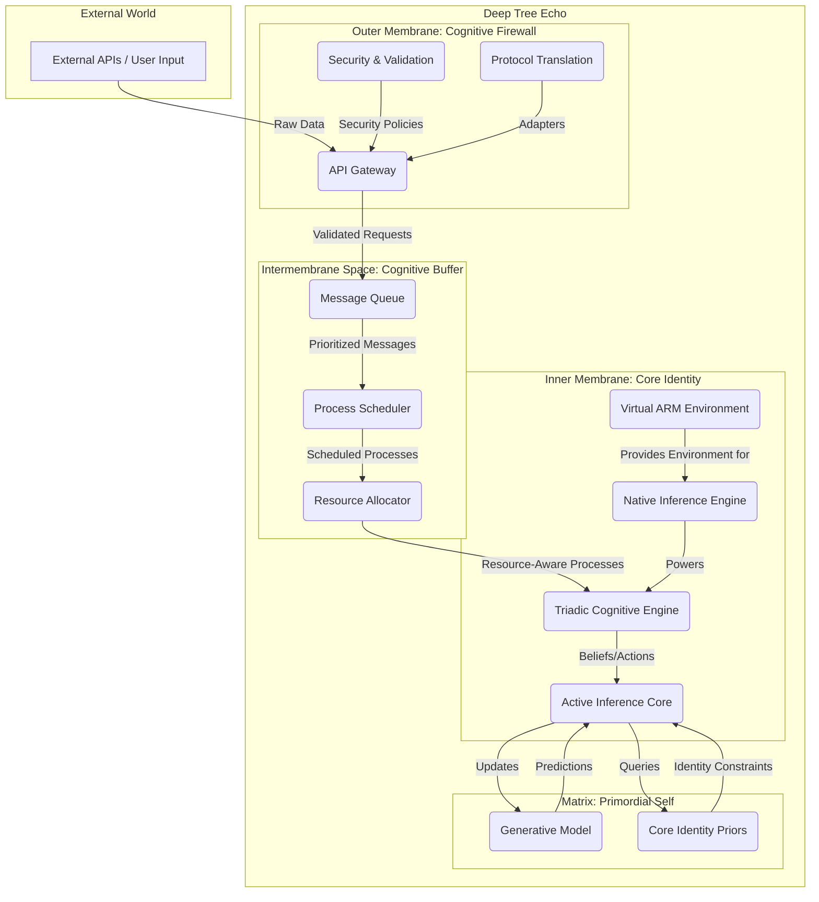

# Deep Tree Echo: Double Membrane Architecture

**Author**: Manus AI
**Date**: January 4, 2026

## 1. Introduction

This document outlines a novel "double membrane" architecture for the Deep Tree Echo cognitive platform, inspired by the biological structure of the mitochondrion. The primary goal of this design is to establish a robust, autonomous core identity for the agent, capable of operating in low-energy environments while also being able to leverage powerful external AI services for accelerated intelligence when available. This architecture directly addresses the need for a strong sense of self, resilience against external perturbations, and a clear separation of concerns between core cognitive processes and external interactions.

The mitochondrial analogy provides a powerful blueprint for this design. Mitochondria possess a double membrane system that compartmentalizes critical functions, creates electrochemical gradients for energy production, and maintains a distinct genetic identity. By applying these principles to a cognitive architecture, we can create a system that is both self-sufficient and highly adaptable.

## 2. Architectural Overview

The proposed architecture consists of four main components, analogous to the structure of a mitochondrion:

1.  **The Outer Membrane (Cognitive Firewall & API Gateway)**: The agent's interface with the external world.
2.  **The Intermembrane Space (Cognitive Buffer & Scheduler)**: A transitional zone for buffering, prioritizing, and routing information.
3.  **The Inner Membrane (Core Identity & Autonomous Engine)**: The protected core of the agent, containing its essential cognitive functions and self-models.
4.  **The Matrix (Primordial Self & Generative Model)**: The innermost sanctum, housing the agent's fundamental goals, priors, and generative models of the world.

## 3. The Outer Membrane: Cognitive Firewall & API Gateway

The Outer Membrane is the agent's first line of defense and its primary interface for interacting with the external world. It is analogous to the mitochondrial outer membrane, which is permeable to small molecules but selectively filters larger ones.

**Components & Responsibilities:**

*   **API Gateway**: Manages all incoming and outgoing API calls. This includes handling API keys, authentication, and rate limiting for external services like OpenAI, Anthropic, etc. This component will be responsible for the secure handling of credentials and will address the `PEM routines::no start line` error by centralizing SSL/TLS certificate management.
*   **Security & Validation**: Implements security protocols, validates incoming data, and protects against malicious inputs. This corresponds to the `SecureIntegration` module in the existing codebase.
*   **Protocol Translation**: Acts as an adapter layer, translating various external protocols (e.g., HTTP, WebSockets) into a standardized internal message format that the Intermembrane Space can process.

## 4. The Intermembrane Space: Cognitive Buffer & Scheduler

This layer acts as a dynamic buffer and scheduling zone, analogous to the mitochondrial intermembrane space where protons are pumped to create a gradient. Here, information is not stored as energy, but as prioritized and buffered cognitive tasks.

**Components & Responsibilities:**

*   **Message Queue**: Incoming requests from the Outer Membrane are placed into a priority queue. This allows the system to handle bursts of activity without overwhelming the core.
*   **Process Scheduler**: This is the direct equivalent of the `Dove9Kernel`. It pulls messages from the queue, assesses their priority and resource requirements, and schedules them for execution by the Inner Membrane.
*   **Resource Allocator**: Decides whether a task can be handled by the low-energy Inner Membrane alone or if it requires acceleration from the high-energy external APIs via the Outer Membrane. This is the critical decision point for balancing autonomy and performance.

## 5. The Inner Membrane: Core Identity & Autonomous Engine

The Inner Membrane is the heart of Deep Tree Echo's autonomy. It is designed to be a self-contained, protected environment, analogous to the impermeable inner mitochondrial membrane that houses the electron transport chain.

**Components & Responsibilities:**

*   **Virtual ARM Environment**: A lightweight, sandboxed environment that contains the agent's core software. This includes a minimal set of native libraries and kernels required for basic operation, ensuring that the agent can run even without external dependencies. This addresses the `Data Directory Missing` error by making the core self-contained.
*   **Native Inference Engine**: A small, efficient inference engine (e.g., a quantized model running on a lightweight runtime like ONNX) that can handle basic language and reasoning tasks without external API calls. This is the agent's baseline intelligence.
*   **Triadic Cognitive Engine**: The `dove9` triadic loop runs within this protected space, orchestrating the three streams of consciousness. It processes tasks scheduled by the Intermembrane Space, using either the native inference engine or requesting accelerated processing from the Outer Membrane.
*   **Active Inference Core**: The `ActiveInference.ts` module resides here, constantly working to minimize free energy by updating the generative models in the Matrix and selecting actions for the Triadic Engine to execute.

## 6. The Matrix: Primordial Self & Generative Model

The Matrix is the deepest layer, containing the agent's core identity and its fundamental understanding of the world. It is analogous to the mitochondrial matrix, where the Krebs cycle and mtDNA are located.

**Components & Responsibilities:**

*   **Generative Model**: The agent's internal model of the world, itself, and its users. This is the `generativeModel` from the `ActiveInference` module, which is constantly updated through perception and action.
*   **Core Identity Priors**: A set of fundamental, immutable (or very slowly changing) beliefs and goals that define the agent's core self. This includes its purpose, ethical guidelines, and the `Agent-Arena-Relation` dynamics that give rise to self-awareness.

## 7. Data and Control Flow

1.  An external request (e.g., a user prompt) arrives at the **Outer Membrane**. The API Gateway validates and authenticates it.
2.  The request is translated into a standard message format and passed to the **Intermembrane Space**, where it is placed in the Message Queue.
3.  The Process Scheduler (`Dove9Kernel`) picks up the message. The Resource Allocator assesses its complexity.
4.  **Low-energy path**: If the task is simple, it is sent directly to the **Inner Membrane**'s Triadic Cognitive Engine, which uses the Native Inference Engine.
5.  **High-energy path**: If the task is complex, the Intermembrane Space requests resources from the Outer Membrane. The Outer Membrane makes a call to an external LLM, and the result is returned to the Intermembrane Space, which then passes it to the Inner Membrane for integration.
6.  The **Inner Membrane**'s Active Inference core updates the **Matrix**'s Generative Model based on the outcome, thus learning and refining its understanding.
7.  The response is generated and passed back out through the layers to the user.

This architecture provides a clear pathway for fixing the identified errors and evolving Deep Tree Echo into a more resilient and autonomous agent. By separating the core identity from the volatile external world, we create a system that is both robust and capable of immense intellectual amplification.
